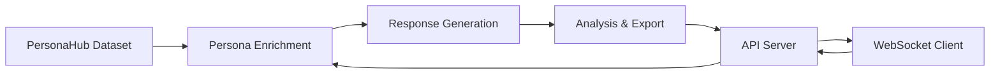

# 🎭 Persona Survey

> **Simulate realistic personas answering surveys based on unique personality traits to reflect human behavior**

A sophisticated AI-powered system that generates authentic, personality-driven responses to survey questions using advanced language models and a rich dataset of human personas. Perfect for market research, user experience testing, and behavioral analysis.

## ✨ Key Features

- 🧠 **Intelligent Persona Generation** - Uses the PersonaHub dataset with 200K+ diverse personas
- 🎯 **Context-Aware Responses** - Enriches personas with behavioral patterns and background
- ⚡ **Async Processing** - Concurrent processing for fast, scalable simulations
- 🌐 **WebSocket API** - Real-time communication for interactive applications
- 📊 **Comprehensive Analysis** - Built-in response analysis and visualization
- 🔄 **Flexible Integration** - Both standalone and API usage modes

## 🚀 Quick Start

### Prerequisites

- Python 3.13 or higher
- OpenAI API key
- [uv](https://docs.astral.sh/uv/getting-started/installation/) (recommended) or pip

### Installation

1. **Clone and setup**:
```bash
git clone https://github.com/gonalbz/persona-survey.git
cd persona-survey
```

2. **Install dependencies**:
```bash
# Using uv (recommended)
uv sync

# Or using pip
pip install -e .
```

3. **Configure environment**:
```bash
# Create .env file
echo "OPENAI_API_KEY=your_api_key_here" > .env
```

### 🎯 Basic Usage

#### Standalone Simulation
```bash
python persona_survey.py
```

#### API Server
```bash
python api.py
# Server starts on http://localhost:8000
```

#### Client Example
```bash
python client_example.py
```

## 📖 Detailed Usage

### 1. Direct Python Integration

```python
import asyncio
from persona_survey import run_simulations

async def main():
    questions = [
        "What motivates you most at work?",
        "How do you prefer to receive feedback?"
    ]
    
    # Generate responses from 50 personas
    results = await run_simulations(questions, num_personas=50)
    
    # Analyze results
    for result in results:
        print(f"Persona: {result['persona'][:100]}...")
        print(f"Response: {result['response']}")
        print("-" * 50)

asyncio.run(main())
```

### 2. WebSocket API Integration

The API provides real-time communication for interactive applications:

```python
import socketio

sio = socketio.AsyncClient()

@sio.event
async def survey_completed(data):
    responses = data['responses']
    print(f"Received {len(responses)} responses!")

# Submit survey
await sio.emit('submit_survey', {
    'question': 'What is your ideal vacation?',
    'num_personas': 100
})
```

### 3. Custom Persona Analysis

```python
from persona_survey import simulate_response

# Test specific persona
persona = "A 35-year-old software engineer who values work-life balance"
question = "How important is remote work to you?"

result = await simulate_response(persona, question)
print(result['response'])
```

## 🏗️ Architecture

### Core Components

```
persona_survey.py     # Core simulation engine
├── load_personas()   # PersonaHub dataset integration
├── enrich_persona_context() # AI-powered persona enrichment
├── simulate_response() # Individual response generation
└── run_simulations() # Batch processing coordinator

api.py               # WebSocket API server
├── FastAPI backend  # REST endpoints
├── Socket.IO        # Real-time communication
└── Event handlers   # Survey submission/completion

client_example.py    # Reference implementation
└── WebSocket client # API interaction examples
```

### Data Flow



## 📊 API Reference

### WebSocket Events

#### `submit_survey`
Submit a new survey for processing.

```json
{
  "question": "Your survey question here",
  "num_personas": 100
}
```

#### `processing_started`
Indicates survey processing has begun.

```json
{
  "message": "Processing survey with 100 personas...",
  "timestamp": "2025-07-12T10:30:00Z"
}
```

#### `survey_completed`
Returns completed survey results.

```json
{
  "status": "success",
  "responses": [
    {
      "persona": "Enriched persona description...",
      "question": "Your survey question",
      "response": "Persona's authentic response..."
    }
  ],
  "metadata": {
    "total_responses": 100,
    "processing_time": "45.2s"
  }
}
```

#### `survey_error`
Error occurred during processing.

```json
{
  "status": "error",
  "message": "Error description",
  "code": "ERROR_CODE"
}
```

## 🔧 Configuration

### Environment Variables

| Variable | Description | Required |
|----------|-------------|----------|
| `OPENAI_API_KEY` | OpenAI API key for GPT models | ✅ |
| `MODEL_NAME` | GPT model (default: gpt-4o-mini) | ❌ |
| `TEMPERATURE` | Response creativity (default: 1) | ❌ |

### Model Configuration

```python
# In persona_survey.py
llm = ChatOpenAI(
    model="gpt-4o-mini",    # Cost-effective, fast responses
    temperature=1,          # High creativity for diverse responses
    api_key=os.getenv("OPENAI_API_KEY")
)
```

## 🎯 Use Cases

### Market Research
- **Product Testing**: Get diverse opinions on new features
- **Brand Perception**: Understand how different demographics view your brand
- **Pricing Strategy**: Test price sensitivity across customer segments

### UX Research
- **User Journey Testing**: Simulate different user types navigating your product
- **Feature Prioritization**: Understand what matters most to different personas
- **Accessibility Testing**: Generate feedback from personas with diverse abilities

### Academic Research
- **Behavioral Studies**: Model human responses at scale
- **Survey Validation**: Test survey questions before real deployment
- **Demographic Analysis**: Understand cultural and social differences

### Content Strategy
- **Audience Testing**: How different groups respond to messaging
- **Tone Assessment**: Find the right voice for your audience
- **Campaign Optimization**: Test variations before launch

## 📈 Performance & Scaling

### Optimization Tips

- **Batch Processing**: Use `num_personas` parameter efficiently
- **Async Operations**: All core functions support concurrent processing
- **Caching**: Consider caching enriched personas for repeated use
- **Rate Limiting**: Monitor OpenAI API usage to avoid limits

### Expected Performance

| Personas | Processing Time | API Calls |
|----------|----------------|-----------|
| 10 | ~15 seconds | 20 |
| 50 | ~45 seconds | 100 |
| 100 | ~90 seconds | 200 |

*Times vary based on question complexity and OpenAI API response times*

## 🤝 Contributing

We welcome contributions! Here's how to get started:

1. **Fork the repository**
2. **Create a feature branch**: `git checkout -b feature/amazing-feature`
3. **Make your changes**
4. **Add tests** for new functionality
5. **Submit a pull request**

### Development Setup

```bash
# Install development dependencies
uv sync --dev

# Run tests
pytest

# Format code
black .
isort .
```

## 📄 License

This project is open source and available under the [MIT License](LICENSE).

## 🙏 Acknowledgments

- **PersonaHub Dataset**: Powers our diverse persona generation
- **LangChain**: Enables seamless LLM integration
- **OpenAI**: Provides the intelligent response generation
- **FastAPI**: Powers our high-performance API

---

**Built with ❤️ for researchers, marketers, and developers who need authentic human-like responses at scale.**

---

### 🔗 Links

- [PersonaHub Dataset](https://huggingface.co/datasets/proj-persona/PersonaHub)
- [OpenAI API Documentation](https://platform.openai.com/docs)
- [LangChain Documentation](https://python.langchain.com/)
- [FastAPI Documentation](https://fastapi.tiangolo.com/)

### 📞 Support

Having issues? Please check our [Issues](https://github.com/gonalbz/persona-survey/issues) page or create a new issue for support.
